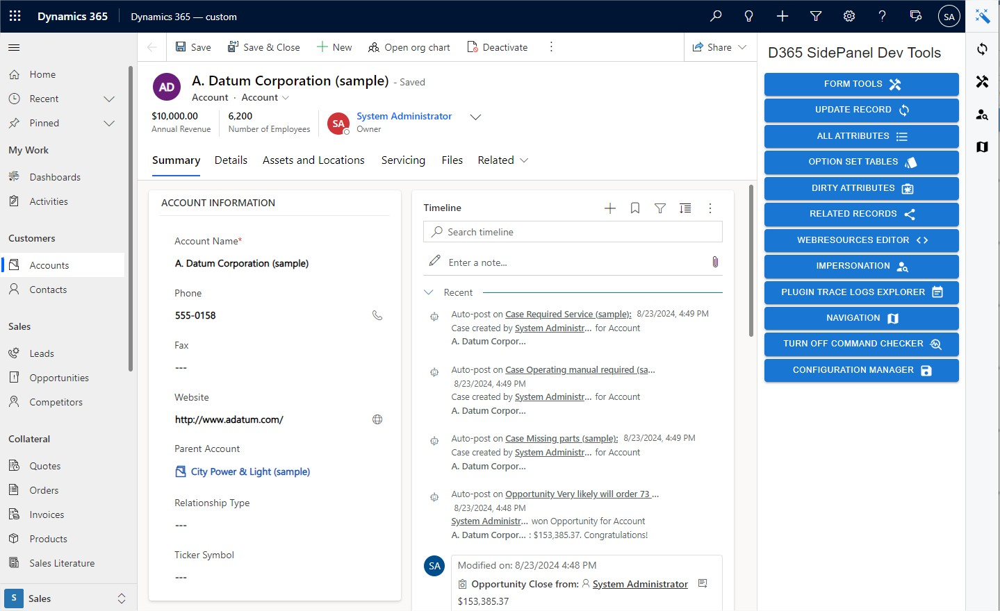

Dynamics 365 SidePanel Tools
============================

## Summary

- [Introduction](#introduction)
- [Available Tools](#available-tools)
    - [Main Menu](#main-menu)
    - [Form Tools](#1-form-tools)
    - [Update Records](#2-update-records)
- [Contribution](#contribution)
- [Licence](#licence)

# Introduction

The Dynamics 365 SidePanel Tools extension provides a powerful suite of utilities that can enhance your productivity. This chromium extension adds a panel to the right side of Dynamics 365 pages, giving you easy access to a variety of tools that can display useful informations or edit data. These tools are designed to be user-friendly and can be opened independently.

# Available Tools

## Main Menu

The main menu can be opened or closed by clicking on the magic wand. The displayed button are used to open the corresponding tools describes below.

## 1\. Form Tools

This tool provide functionnalities used on records form. Each button are reversible : it can be activated or deactivated without refreshing the page.

1. Label Tools: ___Display or hide logical names next to field names. Logical names can be clicked to be copied.___
   * Show/Hide Tab and Section logical names
   * Show/Hide Field and Grid logical names
2. God Mode: ___Change field configurations or restore default configurations.___
   * Mark all fields optionnal
   * Enable all fields
   * Set all fields visible
3. Refresh
   * Refresh Ribbon: ___Reload ribbon__
   * Refresh fields data: __Reload form data__
4. Show option set values in fields: ___Display option set values in option labels___
5. Fill fields with randomized data: ___Allow to generate random data using different methods___
   * Enable Fill on Click: ___Allow to set random data in clicked fields. Can be deactivated.___
   * Fill Mandatory fields: ___Set random data in all mandatory fields on the form.___
   * Fill BPF fields: ___Set random data in all fields on the Business Process Flow.___
   * Fill All fields: ___Set random data in all fields on the form.___
   * Clear all fields: ___Set empty in all fields on the form.___
   * Restore original values: ___Allow you to rollback the fields data to the state at the form loading___
7. Clone the current record: ___Open a dialog with a record duplicating the data of the current record. The open record is not saved at this state___
8. Blur data: ___Blur fields and grids data. This button can be used on Homepage grids.___

## 2\. Update Records

With this tool, you can update any field of any record on your environment. You can even update multiple records at once for bulk updates.

The default record loaded is the currently opened record. You can select different entity and records using the input fields at the top.

To update a field, select it from the dropdown menu. Then, enter a new value in the corresponding input field. You can always restore the original value if needed.

To remove a field from the update list, click the trash bin icon.

Each field type has a matching input type, such as a text box for text fields or a date picker for date fields. Input fields have an icon that you can click to open a tool that helps with data entry.

## 3\. All Attributes

This tool allow you to 

